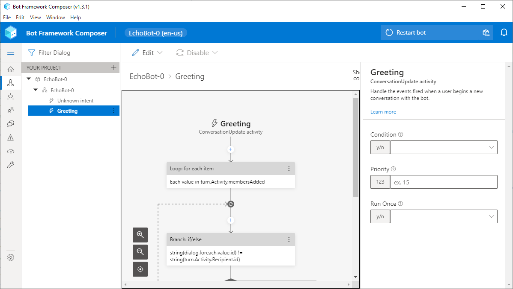
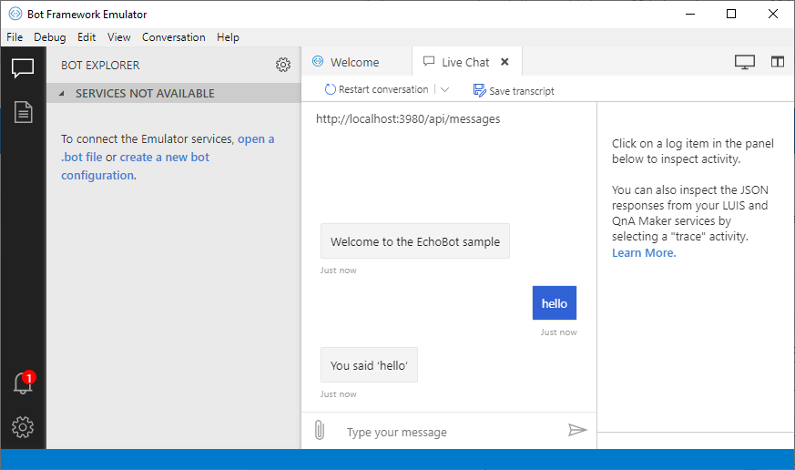

# Microsoft Bot Composer bot

The [Microsoft Bot Composer](https://github.com/microsoft/BotFramework-Composer) is a front-end to many different microsoft AI services.

It supports simple rule-based conversations and more complex intents and loops.
You can edit the bot rules in a visual designer without programming.

The [bot emulator](https://github.com/microsoft/BotFramework-Emulator) lets you test your bot logic without using a chat system.

## Installation

1. Create a CrmScript folder named 'Microsoft Bot'.
2. Place the 3 CrmScripts into the folder.
3. The presence of a script named  `...bot register...` signals the existence of a chatbot in the folder.
4. Go to the Chat admin and open a chat topic.
5. Go to the Chatbot tab and enable the chatbot.
6. Choose the "Microsoft bot" folder from the list, and name the chatbot.
7. Save the chat topic.

Now open a chat window for the chat topic.
You should be greeted by the Microsoft bot using the name you gave in step 6.

## What Happens

### Bot Registration

When the chat channel (aka topic) is configured and saved, the `...bot register...` script is called.
The CrmScript folder is scanned for additional scripts, and the ones with recognized names are noted.
(So adding scripts after the bot is registered will not be noticed until you disable the bot on the channel.)

### Session Created

When a customer clicks the chat button, a new chat session is created.
If the chat channel the session is in has a chatbot enabled, then the chatbot script called `...bot session created...` is called. 

The Microsoft bot scripts calls the Microsoft bot endpoint you have deployed, and posts the response.

### Message Received

When the user posts a message to the channel, and the bot is active, then the script called
`...bot message received...` is called.

The Microsoft bot will get post the message to the Microsoft bot endpoint and get back an intent and parameters.
The script may then process the intents accordingly such as looking up information and posting the results to the chat.
