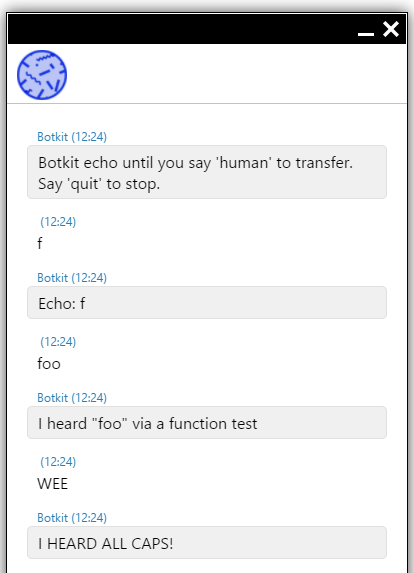

# BotKit Framework bot

The [BotKit framework](https://botkit.ai/) is on open-source framework for bots. It provides support for
conversations, regular expressions, hooks for language understanding services, and lots more.

Our botkit service lives here: https://crm-sod.superoffice.com/botkit/
There is a simple web chat there you can use to test the bot.

It has no state, and just uses some simple matching rules. It is a glorified echo bot.

* "sample" -> I heard a sample message.
* "foo" -> I heard "foo" via a function test
* "123" -> I heard a number using a regular expression.
* "ABC" -> I HEARD ALL CAPS!
* wildcard -> Echo wildcard

We post a request to `https://crm-sod.superoffice.com/botkit/api/messages` 

```json
{   "type":"message",
    "text":"see",
    "user":"28ef498a-936d-9e6a-8117-bb7a20d43e9c",
    "channel":"webhook" }
```

and get back one or more messages:

```json
[ {
    "type": "message",
    "text": "Echo: see"
  } ]
```

## Installation: Botkit

1. Install [NodeJS](https://nodejs.org/en/)
2. Go to the `botkit` folder.
3. Open a command-line window
4. `npm install` will download all the dependencies.
5. `npm run start` wil start the bot on localhost port 3000
6. open a browser to http://localhost:3000/ to see a web chat for testing.

## Installation: Chatbot

1. Create a CrmScript folder named 'Botkit'.
2. Place the 3 CrmScripts into the folder.
3. The presence of a script named  `...bot register...` signals the existence of a chatbot in the folder.
4. Go to the Chat admin and open a chat topic.
5. Go to the Chatbot tab and enable the chatbot.
6. Choose the "Botkit" folder from the list, and name the chatbot.
7. Save the chat topic.

Now open a chat window for the chat topic.
You should be greeted by the Botkit using the name you gave in step 6.



## What Happens

### Bot Registration

When the chat channel (aka topic) is configured and saved, the `...bot register...` script is called.
The CrmScript folder is scanned for additional scripts, and the ones with recognized names are noted.

### Session Created

When a customer clicks the chat button, a new chat session is created.
If the chat channel the session is in has a chatbot enabled, then the chatbot script called `...bot session created...` is called. 

The `bot session created` script calls the botkit API to start the session, and posts a welcome message to the chat.


### Message Received

When the user posts a message to the channel, and the bot is active, then the script called
`...bot message received...` is called.

The script builds a JSON structure with the message text from the customer, and posts it to botkit.
Botkit formulates a response and returns a JSON array with one or more messages.

We post the botkit response as a new message to the chat.
