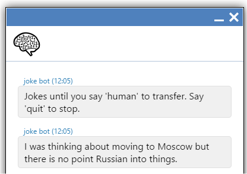

# Data Joke bot

All jokes, all the time.



The bot gets random jokes from a web API, which returns a simple JSON structure:

`GET https://icanhazdadjoke.com/api#fetch-a-random-dad-joke` returns

```json
{
  "id": "R7UfaahVfFd",
  "joke": "My dog used to chase people on a bike a lot. It got so bad I had to take his bike away.",
  "status": 200
}
```

The `joke` value is sent to the chat, and the bot waits for the next message.

The `human` command transfers the session to the queue, where it will be picked up by a fleshbag.

The `quit` command ends the conversation.


## Installation

1. Create a CrmScript folder named 'Dad Joke bot'.
2. Place the 3 CrmScripts into the folder.
3. The presence of a script named  `...bot register...` signals the existence of a chatbot in the folder.
4. Go to the Chat admin and open a chat topic.
5. Go to the Chatbot tab and enable the chatbot.
6. Choose the "Dad Joke bot" folder from the list, and name the chatbot.
7. Save the chat topic.

Now open a chat window for the chat topic.
You should be greeted by Echobot using the name you gave in step 6.


## What Happens

### Bot Registration

When the chat channel (aka topic) is configured and saved, the `...bot register...` script is called.
The CrmScript folder is scanned for additional scripts, and the ones with recognized names are noted.
(So adding scripts after the bot is registered will not be noticed until you disable the bot on the channel.)

### Session Created

When a customer clicks the chat button, a new chat session is created.
If the chat channel the session is in has a chatbot enabled, then the chatbot script called `...bot session created...` is called. 

The dadjokebot posts a message of instructions, then gets a new joke from the api, and posts that too.


### Message Received

When the user posts a message to the channel, and the bot is active, then the script called
`...bot message received...` is called.
The script needs to analyze the message and either

* post one or more reply messages.
* transfer the chat session to the queue for humans to handle.
* change the session status to end the session.

The dadjokebot will get a new joke and post it to the chat if the user's message does not match the "human"
or "quit" commands.
