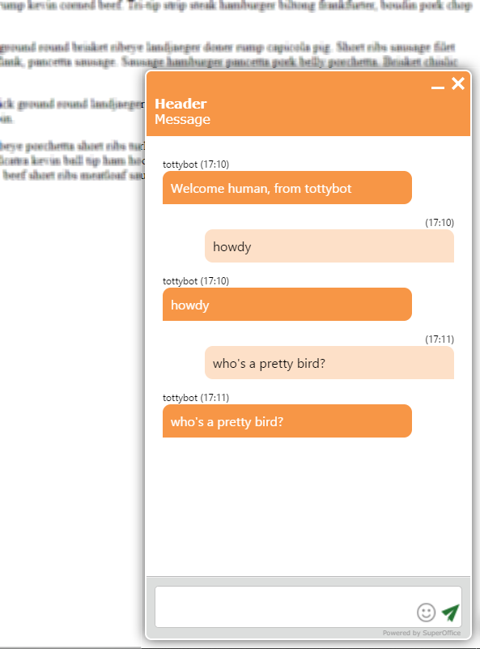
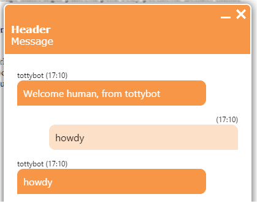

# Echobot

A very simple chatbot.

This simple chatbot is pure CrmScript - it just echoes what the user typed back at them, until the user says "human" or "quit".

The `human` command transfers the session to the queue, where it will be picked up by a fleshbag.

The `quit` command ends the conversation.

## Installation

1. Create a CrmScript folder named 'Echo'.
2. Place the 3 CrmScripts into the folder.
3. The presence of a script named  `...bot register...` signals the existence of a chatbot in the folder.
4. Go to the Chat admin and open a chat topic.
5. Go to the Chatbot tab and enable the chatbot.
6. Choose the "Echo" folder from the list, and name the chatbot.
7. Save the chat topic.

First create the scripts

Then configure a chat channel to use the scripts folder as a bot:

Now open a chat window for the chat topic.
You should be greeted by Echobot using the name you gave in step 6.

## What Happens

### Bot Registration

When the chat channel (aka topic) is configured and saved, the `...bot register...` script is called.
The CrmScript folder is scanned for additional scripts, and the ones with recognized names are noted.
(So adding scripts after the bot is registered will not be noticed until you disable the bot on the channel.)

The echobot does not do anything, but you can use this to set up or clean up things if you need to.

### Session Created

When a customer clicks the chat button, a new chat session is created.
If the chat channel the session is in has a chatbot enabled, then the chatbot script called `...bot session created...` is called. This happens before the FAQ or pre-chat forms are shown.

The bot can post messages if it wants to.

### Message Received

When the user posts a message to the channel, and the bot is active, then the script called
`...bot message received...` is called.
The script needs to analyze the message and either

* post one or more reply messages.
* transfer the chat session to the queue for humans to handle.
* change the session status to end the session.

